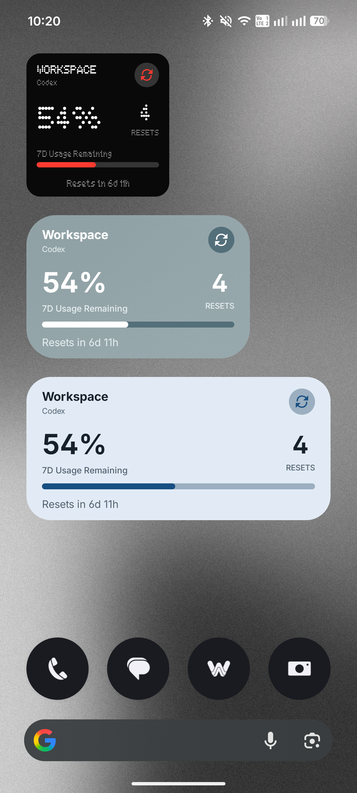
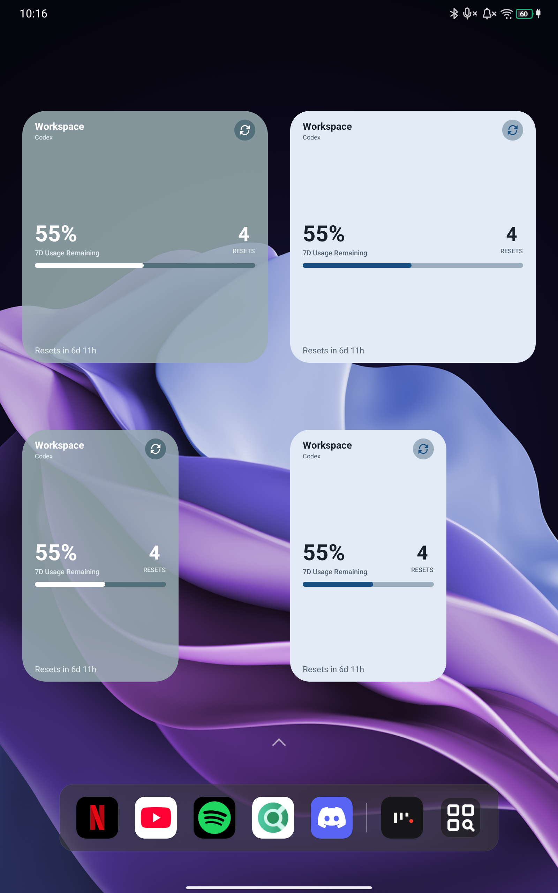
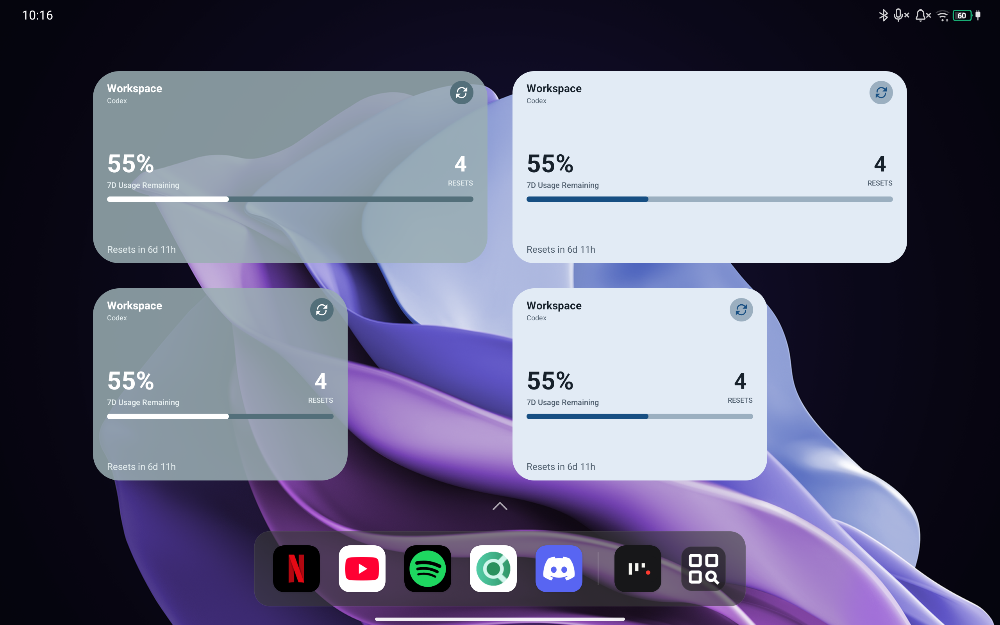

# check-usage

A simple Go CLI app for checking Codex usage limits and available "reset credits" across multiple accounts.

This repository also includes an Android app with home-screen widgets for the same usage information.

## Install

Download a prebuilt binary for your platform from [GitHub Releases](https://github.com/McMelonTV/check-usage/releases) and run `check-usage`/`check-usage.exe` in a terminal.

To build the CLI from source instead, install [Go](https://go.dev/doc/install) and run:

On Linux/macOS:
```bash
go build -o check-usage .
```

On Windows:
```sh
go build -o check-usage.exe .
```

## Get started

Sign in to your first account:

```bash
./check-usage accounts login --provider codex --name "My Account"
```

The account provider is always explicit. Add OpenCode, DeepSeek, or CrofAI with an API key:

```bash
./check-usage accounts add --provider opencode-go --api-key-env OPENCODE_API_KEY
./check-usage accounts add --provider deepseek --api-key-env DEEPSEEK_API_KEY
./check-usage accounts add --provider crof --api-key-env CROF_API_KEY
```

Then open the interactive usage dashboard:

```bash
./check-usage
```

The Bubble Tea interface has Usage, Resets, Accounts, and Settings tabs. Press `Tab` to focus the tab row, then use Left/Right to switch tabs; the active content row remains selected but muted. Press `Tab` again to restore content focus, or press Up/Down to restore focus and move immediately. Use `r` to refresh, `?` for help, and `q` to quit.

Resets uses an account sidebar and immediately shows cached resets for the focused account. Choose an account with Up/Down, then press Enter or Right to focus its reset rows and refresh them. Press Enter twice on a reset to confirm a claim. Claiming is currently a UI-only placeholder and does not call an API; Left or Escape returns to the account sidebar.

Settings let you show used or remaining usage, independently place the bar fill and percentage on the left or right, choose a default, colorblind, or monochrome semantic palette, set an automatic refresh interval, and enable compact account rows. Preferences are stored in `settings.json` beside `accounts.json`. Each account has its own cached snapshot under the platform cache directory (`~/.cache/check-usage/accounts/` on Linux), including when zero resets are available, so cached values or skeletons appear immediately while account requests refresh in parallel.

For a non-interactive table suitable for scripts or logs, use:

```bash
./check-usage --plain
```

Output also switches to the plain table automatically when it is redirected or piped.

For structured application integration, use the importable `usageapi` Go package or the versioned stdin/stdout JSON-RPC interface. No HTTP server is required:

```bash
./check-usage api accounts.list
./check-usage api usage.get '{"refresh":true}'
./check-usage api serve
```

See [Application API](docs/application-api.md) for the complete method list, device-auth flow, NDJSON framing, error behavior, and Go example. API responses expose public account metadata but never stored OAuth tokens.

To see individual reset credits for an account:

```bash
./check-usage resets "My Account"
```

An account can be identified by its name, email, or ID. Add `--show-used` to include redeemed and expired credits.

## Commands

```text
check-usage accounts list
check-usage accounts add --provider opencode-go|deepseek|crof (--api-key key|--api-key-env name) [--name name]
check-usage accounts login --provider codex [--name name] [--no-browser] [--auth-flow device|browser]
check-usage accounts reauth [--api-key key|--api-key-env name] <account-name-email-or-id>
check-usage accounts remove <id-or-name>
check-usage accounts rename <id-or-name> <new-name>
check-usage resets [--show-used] <account-name-email-or-id>
check-usage api [--accounts-file path] [--cache-dir path] <method|serve> [params-json|-]
```

Use `--accounts-file path` to choose a different accounts file or `--timeout seconds` to change the request timeout. By default, accounts are stored in `~/.config/check-usage/accounts.json`.

API keys are stored in that file with owner-only permissions. Prefer `--api-key-env` over `--api-key` so secrets are not exposed in process arguments or shell history.

## Android app ("AI Usage Widgets")

The app signs in separately from the CLI and displays remaining usage windows and "reset credits". It offers Glass and Material You widgets, plus a Nothing-inspired style available on Nothing devices. Each widget can use a different account and style.

### Screenshots

<p align="center">
  
  &nbsp;
  
</p>

<p align="center">
  
</p>

After installing the app, connect a Codex account and add **AI Usage Widgets** from your launcher's widget picker. Account credentials are encrypted using Android Keystore, and the app has no analytics or backend.

To build the Android app from source, you need Go 1.26, JDK 25, Android SDK 36, and an Android 8.0 (API 26) or newer device or emulator. The Gradle build automatically compiles the shared Go provider logic into an AAR using the pinned Go Mobile tool:

```bash
cd android
./gradlew :app:assembleDebug
```

The build creates a universal APK plus `arm64-v8a`, `armeabi-v7a`, `x86_64`, and `x86` APKs under `android/app/build/outputs/apk/debug/`. CI publishes all five variants with stable filenames and a SHA-256 checksum manifest.

The CLI and Android app share `codexapi` for device authorization, token refresh, Codex API requests, JWT identity parsing, and usage-window mapping. Android-specific UI, encrypted credential storage, background work, and widgets remain Kotlin code.

The widgets should automatically refresh approximately every 15 minutes, although the exact refresh timing is controlled by Android and appears to be a bit inconsistent. You should always be able to trigger a refresh using the button in the widget.
